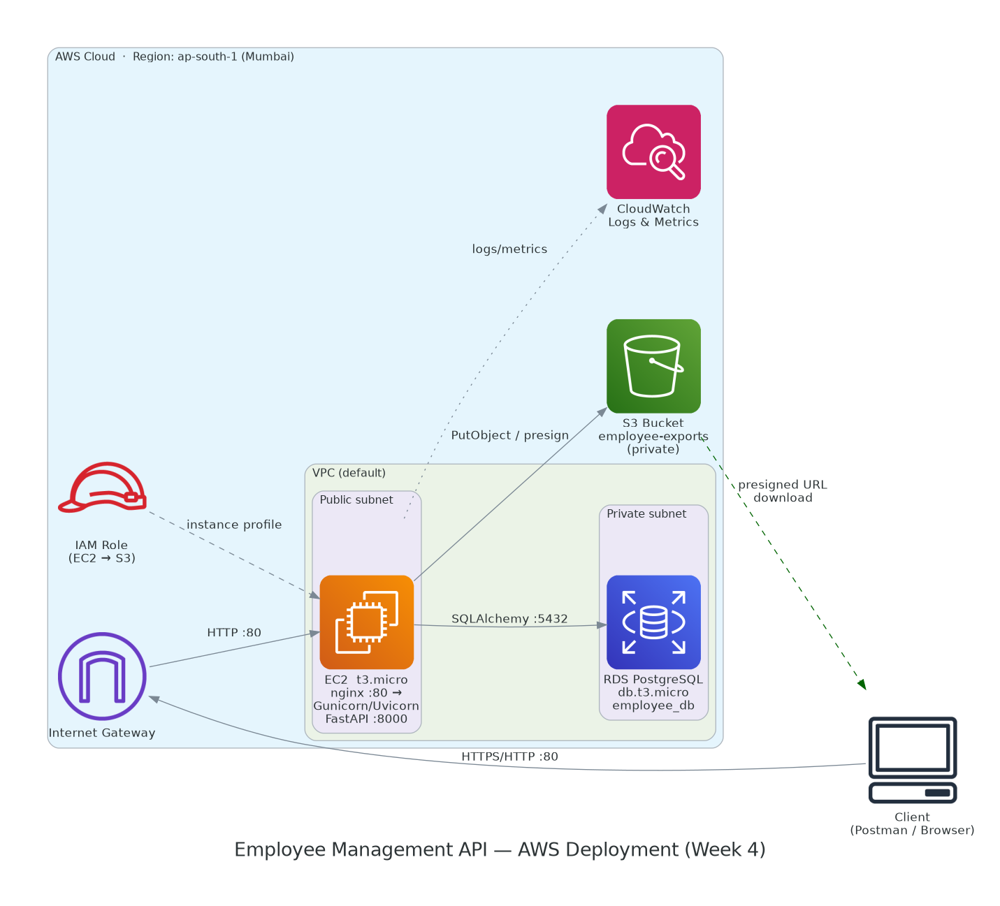

# Employee Management REST API

A PostgreSQL-backed employee management API built with FastAPI and **deployed to AWS** on a real public URL. It includes an endpoint that exports all employee data to a CSV in **Amazon S3**, exercising the full cloud stack (EC2 + RDS + S3 + IAM) in a single request.

## Highlights
* **Live on AWS**: The API runs on an **EC2** instance behind an **nginx** reverse proxy, with **Gunicorn** managing Uvicorn workers. It's kept alive by a **systemd** service so it restarts automatically.
* **Managed Database**: PostgreSQL now runs on **Amazon RDS** instead of my local machine. The app picks this up through a single `DATABASE_URL` environment variable, so no code changed to make the swap.
* **S3 CSV Export**: A new `GET /employees/export` endpoint reads every employee from RDS, writes a CSV to **S3**, and returns a time-limited presigned download link.
* **IAM Roles (no keys in code)**: EC2 talks to S3 using an **IAM instance role**, so there are no AWS access keys anywhere in the repo or on the server.
* **Architecture Diagram**: A full AWS architecture diagram is in `docs/architecture-aws.png`.
* **Deployment Runbook**: Step-by-step copy-paste instructions to reproduce the whole deployment live in `docs/aws-deployment.md`.

## Architecture



The client hits nginx on the EC2 instance over HTTP, which proxies to the FastAPI app. The app reads and writes employee data in RDS PostgreSQL (kept in a private subnet), and for exports it pushes a CSV into S3 and returns a presigned URL the client can download from directly. EC2 gets its S3 permissions from an attached IAM role, and CloudWatch collects metrics with one alarm on CPU.

## The New Endpoint: `GET /employees/export`

This is the endpoint that ties the cloud pieces together. When you call it:

1. The API reads all employees from RDS.
2. It builds a CSV in memory (columns: `id, name, email, department, position, salary, is_active, created_at, updated_at`).
3. It uploads that CSV to S3 using the EC2 instance's IAM role.
4. It returns a JSON response with a **presigned download URL** that's valid for a limited time.

Example response:
```json
{
  "bucket": "your-bucket-name",
  "key": "exports/employees-20260621T130500Z.csv",
  "record_count": 6,
  "generated_at": "2026-06-21T13:05:00+00:00",
  "download_url": "https://your-bucket-name.s3.amazonaws.com/exports/...&X-Amz-Signature=...",
  "expires_in_seconds": 3600
}
```

If S3 isn't configured (like when running locally without a bucket), the endpoint returns a clean `503` instead of crashing, so the rest of the API still works fine on my laptop.

## How to Run It Locally

It runs locally without any AWS setup.

1. **Install Dependencies**
   ```bash
   pip install -r requirements.txt
   ```

2. **Set up PostgreSQL**
   * Make sure you have PostgreSQL running locally (port 5432).
   * Create a database named `employee_db`.
   * Rename `.env.example` to `.env` and put your database password inside it.

3. **Start the Server**
   ```bash
   uvicorn app.main:app --reload
   ```

4. **Test the API**
   Open [http://127.0.0.1:8000/docs](http://127.0.0.1:8000/docs). The Swagger UI lets you test all the endpoints. The server auto-creates the tables and seeds starting data (like Ada Lovelace and Grace Hopper) the first time it boots.

## How to Deploy It to AWS

The full walkthrough is in **[`docs/aws-deployment.md`](docs/aws-deployment.md)**. At a high level:

* Provision an EC2 instance, an RDS PostgreSQL database, an S3 bucket, and an IAM role.
* SSH into EC2 and run `deploy/bootstrap.sh`, which installs everything, sets up the venv, registers the systemd service, and configures nginx.
* Drop in the production environment file (pointing `DATABASE_URL` at RDS and `S3_BUCKET_NAME` at your bucket).
* Start the service and hit the public URL.

The `deploy/` folder contains all the config it needs: `gunicorn_conf.py`, the systemd unit, the nginx config, the IAM policy, and the bootstrap script.

## Project Structure
```
app/
  config.py            # Settings (reads DATABASE_URL, AWS region, S3 bucket from env)
  database.py          # SQLAlchemy engine + session, init_db()
  dependencies.py      # FastAPI dependency providers (now includes S3Service)
  main.py              # App entrypoint + /health
  models/              # Domain model + SQLAlchemy ORM model
  repository/          # Data access layer
  routers/             # API routes (now includes /employees/export)
  schemas/             # Pydantic request/response models
  services/            # Business logic + new s3_service.py
db/                    # Raw SQL schema, seed data, queries
deploy/                # AWS deployment configs (nginx, systemd, gunicorn, IAM, bootstrap)
docs/                  # ER diagram, AWS architecture diagram, deployment runbook
```
