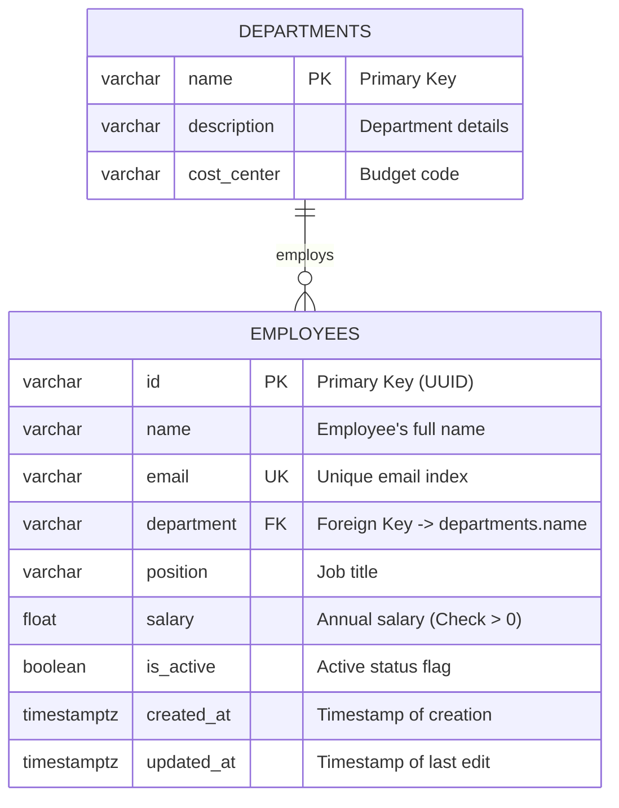

# Entity-Relationship Diagram

```mermaid
erDiagram
    DEPARTMENTS ||--o{ EMPLOYEES : employs
    DEPARTMENTS {
        varchar name PK "Primary Key"
        varchar description "Department details"
        varchar cost_center "Budget code"
    }
    EMPLOYEES {
        varchar id PK "Primary Key (UUID)"
        varchar name "Employee's full name"
        varchar email UK "Unique email index"
        varchar department FK "Foreign Key -> departments.name"
        varchar position "Job title"
        float salary "Annual salary (Check > 0)"
        boolean is_active "Active status flag"
        timestamptz created_at "Timestamp of creation"
        timestamptz updated_at "Timestamp of last edit"
    }
```
